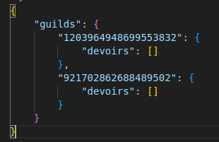
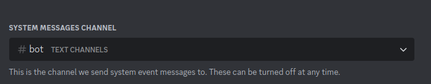

# Discord Homework Reminder Bot

## Overview

The Discord Homework Reminder Bot is designed to help students keep track of their homework assignments by creating events and sending reminders in a designated channel. The bot supports multiple servers and (WIP) allows for customization of reminder settings.

## Features

- **Event Creation**: Automatically creates an event when a homework assignment is added.
                    People will have to check "i'm interested" on the event to get notifications, can't force it...
- **Delete Command**: Allows users to delete both the homework assignment and the associated Discord event.
- **Multi-Server Support**: The bot's JSON formatting allows it to be used across multiple servers.

- **System Channel Reminders**: Sends reminders in the system channel (Right click on the serer > Server Settings > Overview > Choose the channel).

    

## Installation
You need to install it yourself, create an app in discord dev portal, create the invite link using the appropriate perms ( send messages, create embed, manage events, emojis etc ) or just make it admin if you don't want to bother fine-tuning perms
get the token and you'll be able to start the bot
Either start the bot using the main python file
Or the manage_bot.sh if you want to run it in a docker container
*WIP* 

## Usage
Adding Homework
### Adding Homework
`!add <date> <heure> <titre>`
### Delete Homework
`!delete <titre>`
### List all homeworks
`!list`
### Show commands 
`!usage`

## TODO List

- **Fix Small Bugs**: Address minor issues and improve stability.
- **Rate Limit Handling**: Fix or find a workaround for rate limits; limit command usage if necessary.
- **Settings Command**: Add a command to manage settings, including:
    - Switching reminder language from French to English.
    - Restricting command usage to specific roles or permissions.
- **Automatic Reminder Channel Setup**: Add a command to automatically set the reminder channel ( -1 user action )

## Update 19/09/2024

- **Revamped the Bot**
- **Simplified Event Types**: Removed all types; the default and only type is now the old "reminder". ( so no event and daily types anymore )
- **Enhanced Reminder Schedule**: Reminders will be sent at 14, 7, 3, 1, and less than 1 day remaining. You'll be able to configure this in the future
- **Modular Commands**: Commands are now split into multiple modules for easier code management.
- **Commands**: Commands are shorter for simplicity.
- **Clean Chat**: The bot will now add a check emoji instead of sending a message.
- **Event Creation**: The bot will create an event when adding a homework assignment.
- **Improved Delete Command**: will remove the reminder AND the event
- **JSON**: Updated formatting to support multiple servers.
- **System Channel Reminders**: Change from channel id to this ( find it better)
- **Added .gitignore**
- **Cleaned requirements.txt**
- **Fixes**

